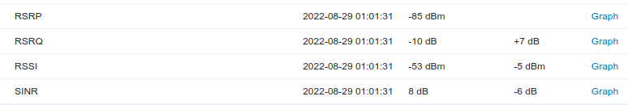
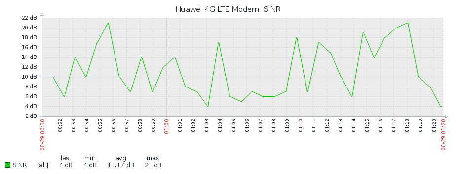
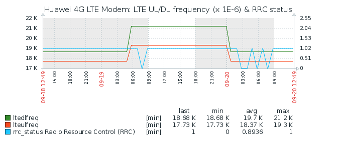

# Huawei LTE modem monitor for Zabbix

* monitors certain parameters from a Huawei modem using the [huawei-lte-api](https://github.com/Salamek/huawei-lte-api)
* sends values to a [Zabbix](https://www.zabbix.com/) server 

* values can be configured to be reported (sent) as follows:
    * each time polled
    * reported only when changed  (reports value from last polling interval too)
    * or after certain intervals

* uses the following libraries
    * https://github.com/Salamek/huawei-lte-api
	* https://github.com/adubkov/py-zabbix
        * https://py-zabbix.readthedocs.io/en/latest/sender.html

## Current status

* Currently focused only on collecting data from the
  =huawei.lte.device.signal= part of the api 
* Testing with python 3.9
* Tested on Huawei B535-333
  * Zabbix Template and configuration made for this model. 
  
* Handles connection problems to modem and zabbix moderately well
  (see tests/NOTES.md)

## next
* need to fix logging (configure levels)
* make more stuff configurable 
  * api endpoints, keys, polling interval and sending strategyies will be configured by a YAML file which will be used to make a dictionary
* improve clarity of counter and timer printed info
* use less globals 
* 

### IDEAS / TODO,
  - handle other parts of the api via YAML config file 
    without making configuration to appear too difficult?
  - handle parsed arguments
  - generate a simple zabbix template?
  - items suitable for populating zabbix inventory
  - client.device.information
  - client.device.basic_information
  - client.device.antenna_type
  - client.monitoring.check_notifications
  - Net.current_plmn (operator name)
  - Monitoring.traffic_statistic (connect time)
  - certain IP addresses
  - Sms.sms_count
  - OnlineUpdate.status
  - User.history_login
