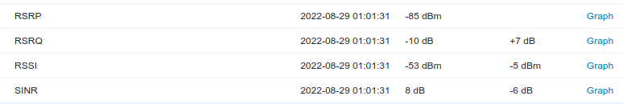
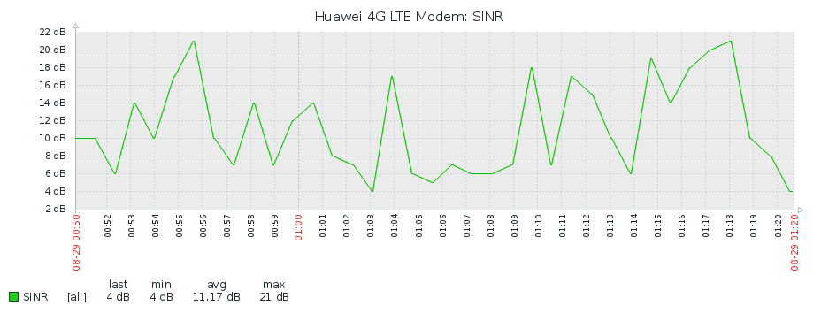
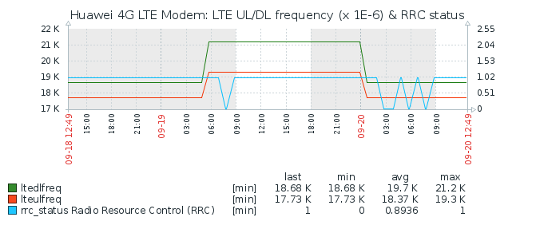

# Huawei LTE modem monitor for Zabbix

* monitors certain parameters from a Huawei modem using the [huawei-lte-api](https://github.com/Salamek/huawei-lte-api)
* sends values to a [Zabbix](https://www.zabbix.com/) server 

* values can be configured to be reported (sent) as follows:
    * each time polled
    * reported only when changed  (reports value from last polling interval too)
    * or after certain intervals

* uses the following libraries
    * https://github.com/Salamek/huawei-lte-api
	* https://github.com/adubkov/py-zabbix
        * https://py-zabbix.readthedocs.io/en/latest/sender.html

## Current status

* Testing with python 3.9
* Tested on Huawei B535-333
  * Zabbix Template and api configuration made for this model
    * monitors endpoint and keys that I am interested in
* Using with zabbix 4.2 ( should work with newer versions, but haven't tried the template)

* Handles connection problems to modem and zabbix moderately well
  (see tests/NOTES.md)
* api endpoints, keys, polling interval and sending strategies are configured by a YAML
  file generates a dictionary with information about how to handle each key

## Configuration

* =config.yml= place for default stuff, ideally safe to be on a public repo
* =own_config.yml= writes over variables in =config.yml=
* =api_poll_config:= in the above config files sets the location of the api polling configuration
  * api polling configuration is defined in =api_design.yml=
  * =api_huawei_lte_4g_config.yml= works with the current zabbix template

## next
* need to fix logging (configure levels)
* make more stuff configurable 
* improve clarity of counter and timer printed info
* use less globals 
* move functions that are not specific to the modem into modules
* poll endpoints with fixed polling more often ... overrides polling_interval

### IDEAS / TODO,
- handle parsed arguments
- zabbix related
  - auto generate a simple zabbix template?
    - items suitable for populating zabbix inventory
  - new endpoints
    - client.device.basic_information
    - client.device.antenna_type
    - client.monitoring.check_notifications
    - Net.current_plmn (operator name)
    - Monitoring.traffic_statistic (connect time)
    - Sms.sms_count
    - OnlineUpdate.status
